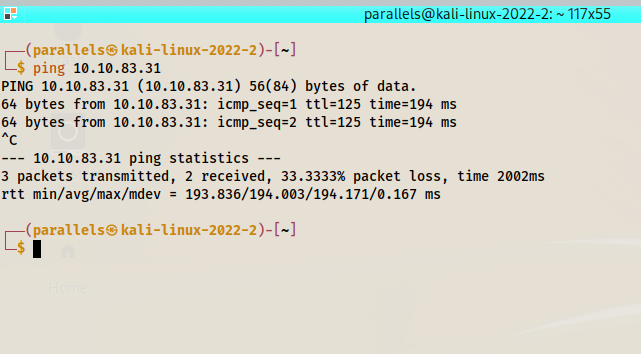
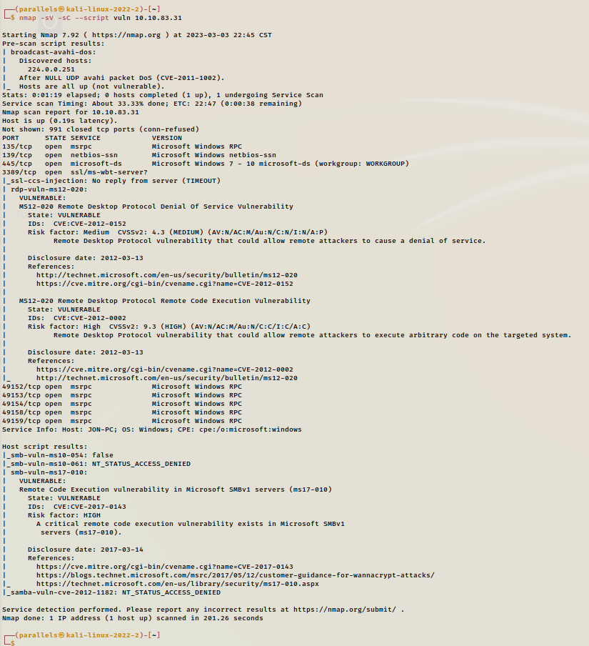
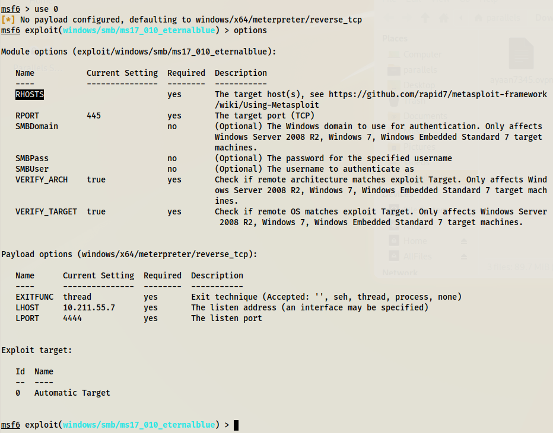
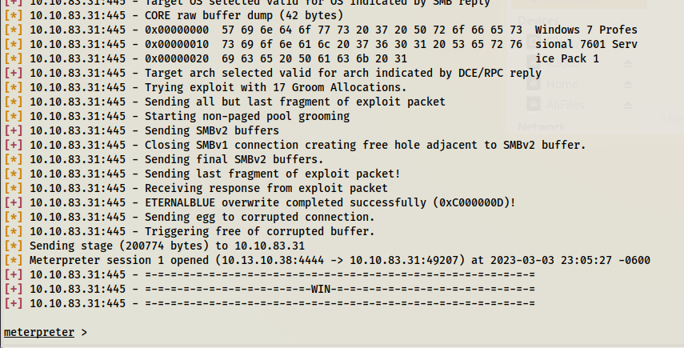

- #THM
- Information given
	- IP 10.10.83.31
- Recon
  collapsed:: true
	- Ping
	  collapsed:: true
		- 
	- Nmap scan #nmap
	  collapsed:: true
		- 
		-
		-
	- Recon summary
	  collapsed:: true
		- Upon completion of the nmap scan, it has been discovered that the system under investigation is vulnerable to multiple attacks including the MS12-020 Remote Desktop Protocol Denial Of Service Vulnerability, MS12-020 Remote Desktop Protocol Remote Code Execution Vulnerability, and a Remote Code Execution vulnerability in Microsoft SMBv1 servers (ms17-010). It is important to note that the ms17-010 vulnerability poses the highest risk to the system's security.
- Enumeration
	- Metasploit vulnerability
		- 
		- To run the vulnerability the RHOST is needed to be set which is the targets ip address
		- Meterpriter shell was created
			- 