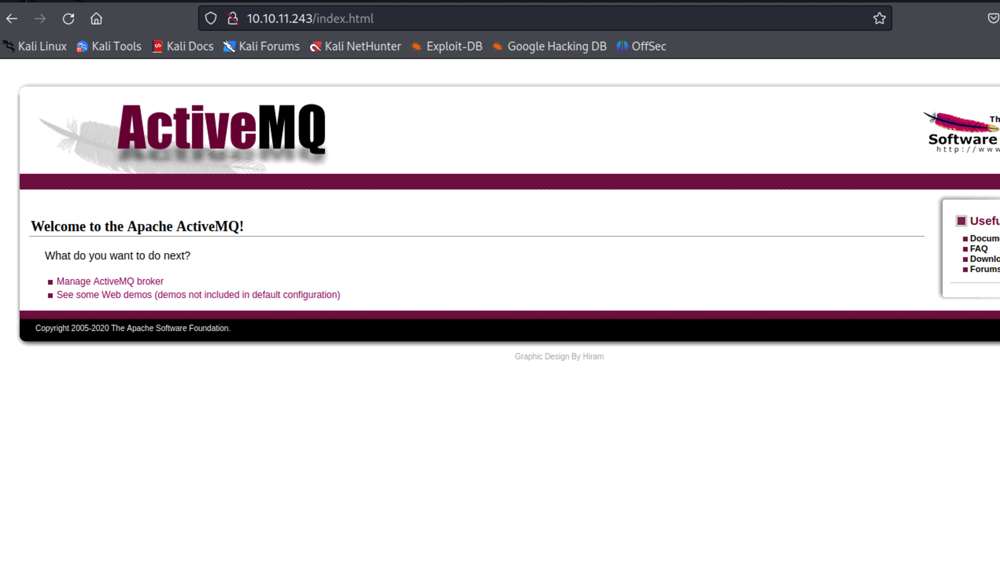

- /
- #HTB
	- **CTFe**
	- **CTF**
		- Recon
			- Nmap Scan
				-
			- Fuff Scan
			- Nikto Scan
		- Web exploitation
		- Privilege Escalation
		- Notes
			- Resources
			- Strategies
				- First started by checking if the ip had a web interface found that it did then it gave me a login page the login and password was admin admin entered into a webpage
					- 
				- Looking into what Active MQ is
					- what is ActiveMq
						- ActiveMQ is an open-source message broker that facilitates the communication between different applications using the publish-subscribe or point-to-point messaging patterns. It provides reliable messaging and enables seamless integration between various components of a distributed system. ActiveMQ supports multiple messaging protocols such as Java Message Service (JMS), Advanced Message Queuing Protocol (AMQP), and Message Queuing Telemetry Transport (MQTT). It offers features like message persistence, message filtering, message routing, and load balancing, making it a popular choice for building scalable and resilient messaging systems.
			- Other Notes