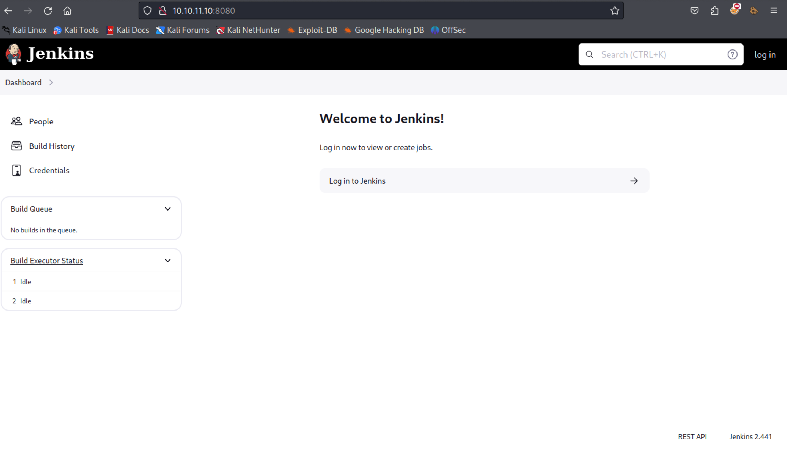
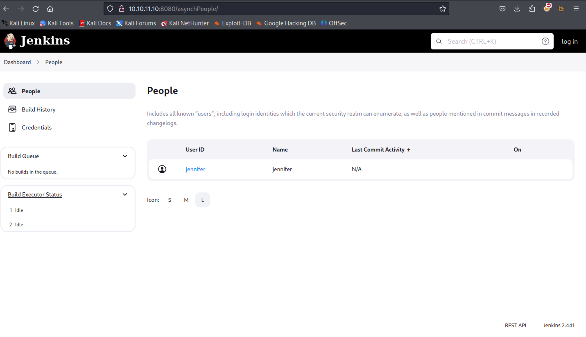
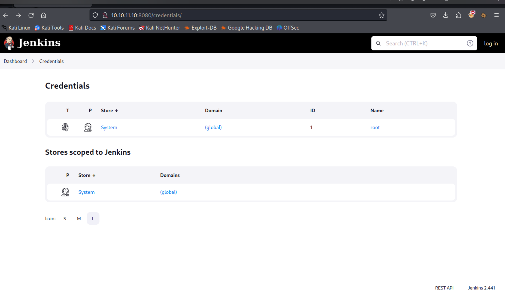

- #HTB
	- **Builder**
		- Recon
			- Nmap Scan
				- Port Scan
				  collapsed:: true
					- ```terminal
					  # Nmap 7.93 scan initiated Sat Mar 23 02:09:35 2024 as: /usr/bin/nmap -T4 --max-retries 1 --max-scan-delay 20 --open -oN nmap/Port_10.10.11.10.nmap --system-dns --stats-every 1s 10.10.11.10
					  Nmap scan report for 10.10.11.10
					  Host is up (0.083s latency).
					  Not shown: 998 closed tcp ports (conn-refused)
					  PORT     STATE SERVICE
					  22/tcp   open  ssh
					  8080/tcp open  http-proxy
					  
					  # Nmap done at Sat Mar 23 02:09:36 2024 -- 1 IP address (1 host up) scanned in 0.94 seconds
					  ```
				- Script Scan
				  collapsed:: true
					- ```terminal
					  # Nmap 7.93 scan initiated Sat Mar 23 02:09:36 2024 as: /usr/bin/nmap -sCV -p22,8080 --open -oN nmap/Script_10.10.11.10.nmap --system-dns --stats-every 2s 10.10.11.10
					  Nmap scan report for 10.10.11.10
					  Host is up (0.046s latency).
					  
					  PORT     STATE SERVICE VERSION
					  22/tcp   open  ssh     OpenSSH 8.9p1 Ubuntu 3ubuntu0.6 (Ubuntu Linux; protocol 2.0)
					  | ssh-hostkey: 
					  |   256 3eea454bc5d16d6fe2d4d13b0a3da94f (ECDSA)
					  |_  256 64cc75de4ae6a5b473eb3f1bcfb4e394 (ED25519)
					  8080/tcp open  http    Jetty 10.0.18
					  | http-robots.txt: 1 disallowed entry 
					  |_/
					  |_http-server-header: Jetty(10.0.18)
					  |_http-title: Dashboard [Jenkins]
					  | http-open-proxy: Potentially OPEN proxy.
					  |_Methods supported:CONNECTION
					  Service Info: OS: Linux; CPE: cpe:/o:linux:linux_kernel
					  
					  Service detection performed. Please report any incorrect results at https://nmap.org/submit/ .
					  # Nmap done at Sat Mar 23 02:09:48 2024 -- 1 IP address (1 host up) scanned in 12.08 seconds
					  ```
			- Found there was a web server open on port 8080 
			- Looked for vulnerability's for Jenkins 2.441 https://github.com/Praison001/CVE-2024-23897-Jenkins-Arbitrary-Read-File-Vulnerability
			- Found a user named jennifer 
			- And this credentials page 
			-
		- Foothold
		- Privilege Escalation
		- Notes
			- Resources