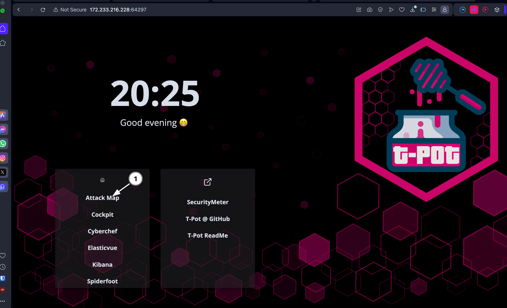
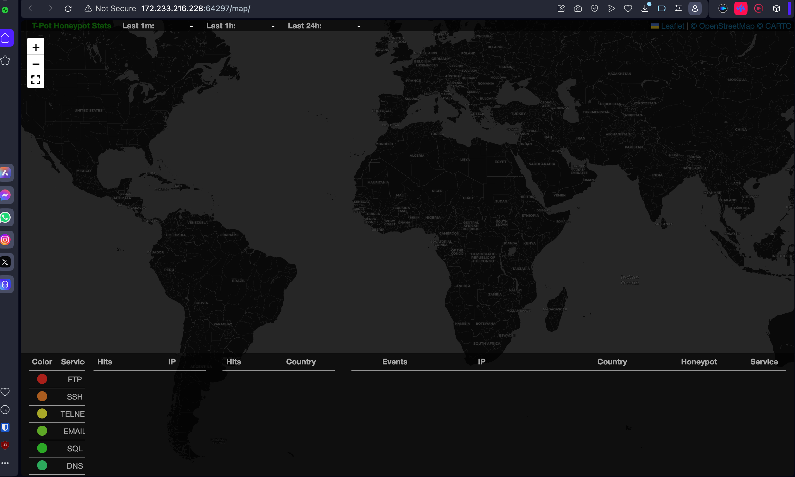
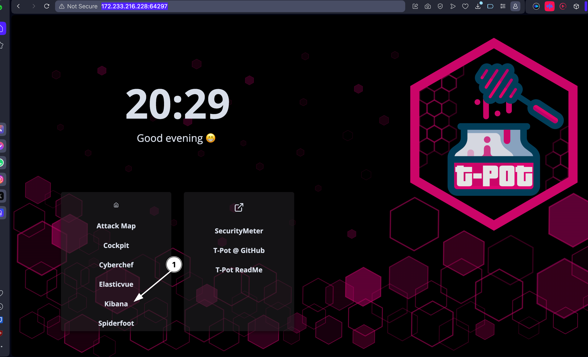
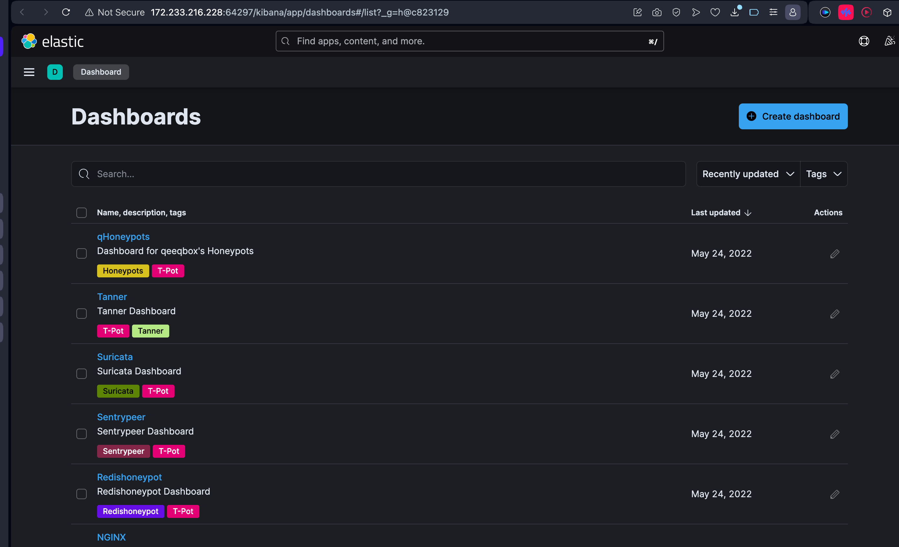
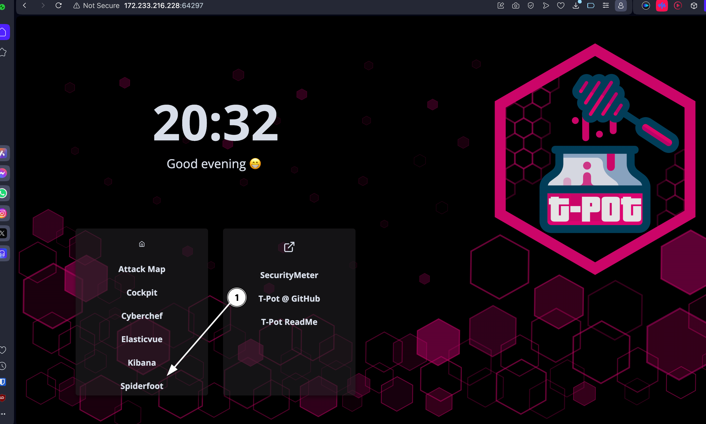
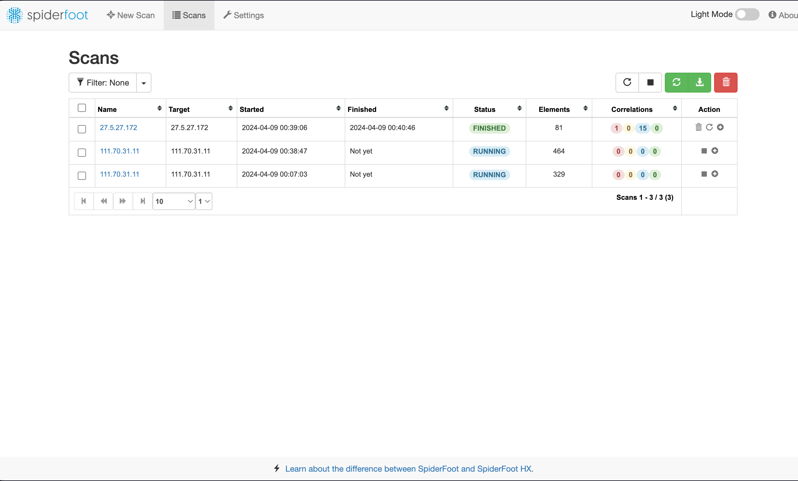

# How to access my honeypot
- Go to this link
	- https://172.233.216.228:64297
	- Username
		- ```bash
		  Borough0419
		  ```
	- Password
		- ```bash
		  ypJboHyx%oR3KKv#^Jg@
		  ```
	- Then Open the attack map
		- 
	- Once the attack map is open give it a few moments to populate
		- 
		-
	- After the data has populated go back into the home page
		- ```bash
		  https://172.233.216.228:64297
		  ```
	- Then open up kibana there are many dashboards to choose from my favorite is the Cowrie dashboard its a ssh dash board and you can see what the attacker is inputing in real time
	  collapsed:: true
		- 
		- 
	- If you find anything intresting you can run a scan on them by going back to the home page and run a scan with Spiderfoot
		- 
		- 
		-
	-