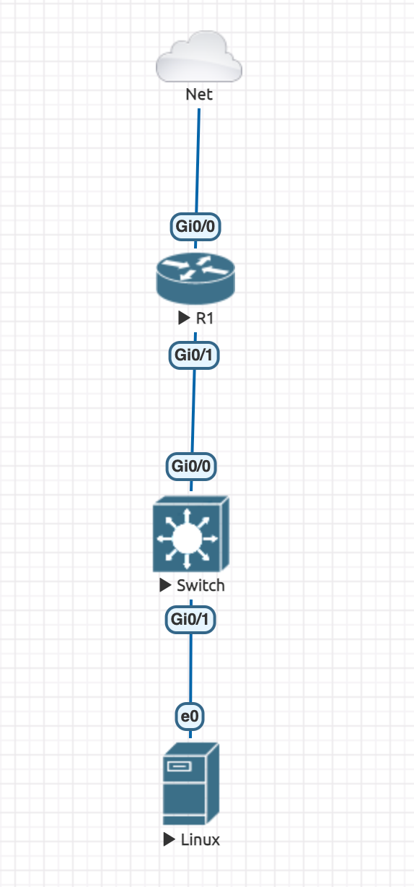

## Creating a Simple #network with Cisco Gear
collapsed:: true
	- Network Topology Diagram
	  collapsed:: true
		- {{renderer :drawio, 1711145213409.svg}}
		- 
	- Router configuration
	  collapsed:: true
		- ```CISCO
		  ! Enable interfaces
		  enable
		  configure terminal
		  
		  ! Configure WAN interface
		  interface GigabitEthernet0/0
		   ip address 192.168.99.2 255.255.255.0
		   description WAN Interface
		   no shutdown
		  
		  ! Configure LAN interface
		  interface GigabitEthernet0/1
		   ip address 192.168.1.1 255.255.255.0
		   description LAN Interface
		   no shutdown
		  
		  ! Enable NAT for internet access
		  ip nat inside source list NAT_ACL interface GigabitEthernet0/0 overload
		  access-list 1 permit 192.168.1.0 0.0.0.255
		  ip nat inside source list 1 interface GigabitEthernet0/0 overload
		  
		  ! Configure DHCP for internal network
		  ip dhcp pool LAN_POOL
		   network 192.168.1.0 255.255.255.0
		   default-router 192.168.1.1
		   dns-server <DNS_SERVER_IP>   ! Replace <DNS_SERVER_IP> with actual DNS server IP
		  
		  ! Optionally configure firewall rules
		  access-list 100 permit ip any any   ! Allow all traffic (modify as per security requirements)
		  interface GigabitEthernet0/0
		   ip access-group 100 in
		  
		  end
		  write memory
		  ```
	- Switch configuration
	  collapsed:: true
		- ```Cisco
		  ! Enable interfaces
		  enable
		  configure terminal
		  
		  ! Configure VLANs
		  vlan 10
		   name Internal_Network
		  vlan 20
		   name WAN_Network
		  
		  ! Assign ports to VLANs
		  interface range GigabitEthernet0/1 - 8   ! Assuming 8 ports for hosts
		   switchport mode access
		   switchport access vlan 10
		  
		  ! Connect router to switch
		  interface GigabitEthernet0/24   ! Assuming this is the connection to the router
		   switchport mode trunk
		   switchport trunk allowed vlan 10,20
		  
		  ! Optionally enable port security
		  interface range GigabitEthernet0/1 - 8
		   switchport port-security
		   switchport port-security maximum 1
		   switchport port-security violation restrict
		   switchport port-security aging time 2
		   switchport port-security aging type inactivity
		  
		  end
		  write memory
		  ```