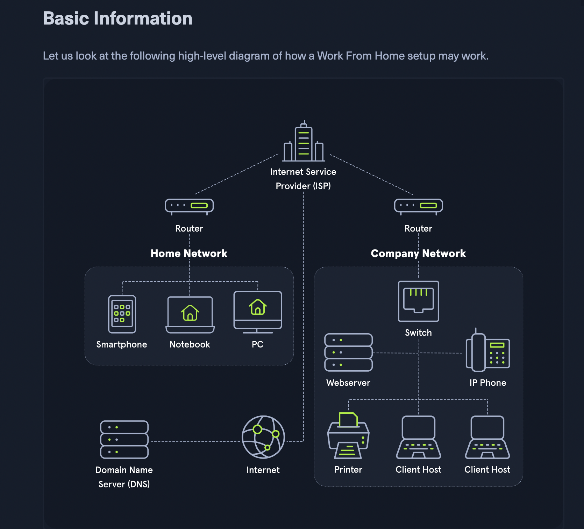

- The importance of #networking
- Questions
	- What is Suricata or Snort
		- Suricata and Snorby are open-source intrusion detection and prevention tools. Suricata is a network security monitoring engine, capable of detecting malicious activity in real time on network traffic. Snorby is a web-based front-end for the Snort IDS system, allowing users to monitor and analyze network traffic.
	- What is impacket
		- Impacket is a Python library for working with network protocols at a low level.  It allows developers to craft and decode network packets and perform forensics, penetration testing, and many other security related tasks. It provides several modules that enable packet manipulation, the ability to create and decode network packets, sniffers, and many other functions.
	- What does a diagram of a work from home setup look like 
	- What is the difference between a URL and FQDN
		- A URL (Uniform Resource Locator) is a specific address on the internet that is used to access a web page, whereas a FQDN (Fully Qualified Domain Name) is the domain name used to locate computers and resources over a network. A URL is a more specific address, and a FQDN can contain multiple URLs.
	- What is NTLMv2
		- NTLMv2 (short for NT LAN Manager version 2) is a variation of the NT LAN Manager (NTLM) authentication protocol. It is the default authentication protocol used by Microsoft Windows and is a part of the Windows Security mechanism. NTLMv2 uses stronger encryption than the original NTLM and can help prevent the "pass the hash" attack and other similar techniques. GPT-b is a part of the NTLMv2 authentication protocol that provides stronger authentication for domain logons. When used, GPT-b provides the addition of server security checks that reduce the risk of unauthorized access.
-
-
-