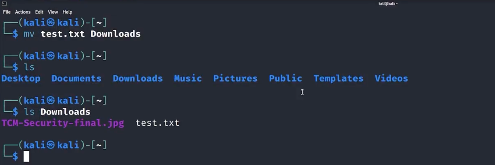

- #Commands
	- What is SUDO in linux #Sudo
	  collapsed:: true
		- SUDO (superuser do) is a Linux based command that allows users to run programs or commands with the security privileges of another user, usually the system administrator. Sudo enables access to important system functions and commands that would otherwise be blocked off by the user's regular security level.
		- `sudo -l`
		  collapsed:: true
			- explanation: Lists the commands a user is allowed to run with `sudo` privileges.
			- Example: Running `sudo -l` would display the commands and permissions available to the current user with `sudo` access.
	- What is #pwd in linux
	  collapsed:: true
		- pwd stands for 'print working directory' in Linux. It is a command that prints the name of the current/working directory to the standard output.
		- 
	- What is the #cd used for
		- To move from directory to directory you use the command change directory (cd) to move around in the linux terminal.
		- {:height 162, :width 642}
	- What is #ls
		- ls is used to list all the documents in the directory
		- 
		- ls -la (List Detailed Directory Contents):
		- Explanation: Lists detailed information about files and directories, including hidden files.
		- Example: Running `ls -la` would display a detailed list of files and directories, including hidden files, in the current directory.
		- `ls -la` output, the "rwx" refers to the #permissions associated with a file or directory.
		- - Read (r): Allows the entity to read or view the contents of a file or the names of files within a directory.
		  Write (w): Enables the entity to modify or write to a file or add, delete, or rename files within a directory.
		  Execute (x): Grants the entity the permission to execute a file or enter a directory. For directories, execute permission is required to access its contents.
		- In the `ls -la` output, the permissions are displayed as a series of nine characters. The first character represents the file type (e.g., `-` for a regular file, `d` for a directory). The next three characters represent the owner's permissions, followed by the group's permissions, and then the permissions for other users.
		- For example, let's consider an `ls -la` output line:
		  ```
		  -rwxr-x--- 1 user group 4096 May 10 12:34 myfile.txt
		  ```
		- `-rwxr-x---`: The first character indicates that it is a regular file. The following three characters (`rwx`) represent the owner's permissions (read, write, and execute). The next three characters (`r-x`) represent the group's permissions (read and execute). The last three characters (`---`) represent the permissions for other users (no permissions).
		   `1`: Indicates the number of hard links to the file.
		   `user`: Refers to the owner of the file.
		   `group`: Refers to the group assigned to the file.
		   `4096`: Indicates the file size in bytes.
		   `May 10 12:34`: Specifies the date and time of the last modification.
		   `myfile.txt`: Represents the name of the file.
	- What is #mkdir
	  collapsed:: true
		- This command creates a folder from the terminal
		- 
	- What is #cat
	  collapsed:: true
		- This command that opens a file in the terminal
		- 
	- What is #nano
	  collapsed:: true
		- Nano is a text editor in Linux used to create, view, and edit text files. It's an intuitive text editor, designed to be as user-friendly as possible, despite the fact that it runs in a linux terminal. It's easy to learn for beginner users, allowing them to quickly navigate and manipulate text. Nano also has a number of convenient features such as color-coded syntax highlighting, search and replace capabilities, auto-complete, an integrated spell-checker, and shortcuts to quickly navigate and edit text.
		- 
		- Once the command is entered the terminal will change to look like a text editor
		- 
		- Now add the information in the file but before closing out make sure to save or it wont save
		- NANO IS FAR SUPERIOR TO VIM DON'T BELIVE WHAT ANYONE ELSE SAYS
	- what is #cp
	  collapsed:: true
		- cp is the command that copy's files
		- 
		-
	- What is #mv
	  collapsed:: true
		- the move command moves files and directories
		- 
		- Once the file is moved it wont be in its original place
		-
	- What is #chmod
	  collapsed:: true
		- Explanation: Changes the permissions of a file or directory.
		- Example: Running `chmod +x script.sh` would add the execute permission to the file "script.sh", allowing it to be executed as a script.
		- What are the Chmod numbers
			- 
			- use #ls to find the permissions and change them
	- what is #adduser
	  collapsed:: true
		- Explanation: Creates a new user account.
		  Example: Running `adduser john` would create a new user account with the username "john" and prompt for additional user information.
	- what is #su
	  collapsed:: true
		- Explanation: Allows a user to switch to another user account.
		  Example: Running `su jane` would switch to the user account "jane" after entering the password for that account.
		-
- #Important_Linux_dirs_files
	- #sudoers configuration information for the #Sudo command
		- `/etc/sudoers`
			- Explanation: Displays the content of the "/etc/sudoers" file, which contains configuration information for the `sudo` command.
			- Example: Running `cat /etc/sudoers` would display the configuration directives for `sudo` access and permissions.
		-