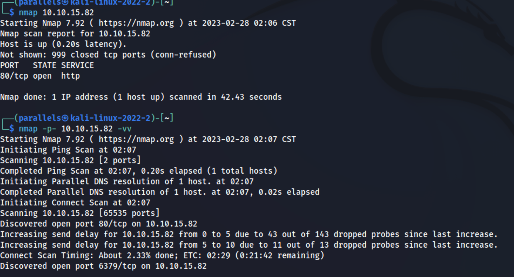
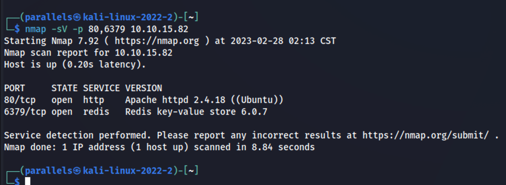
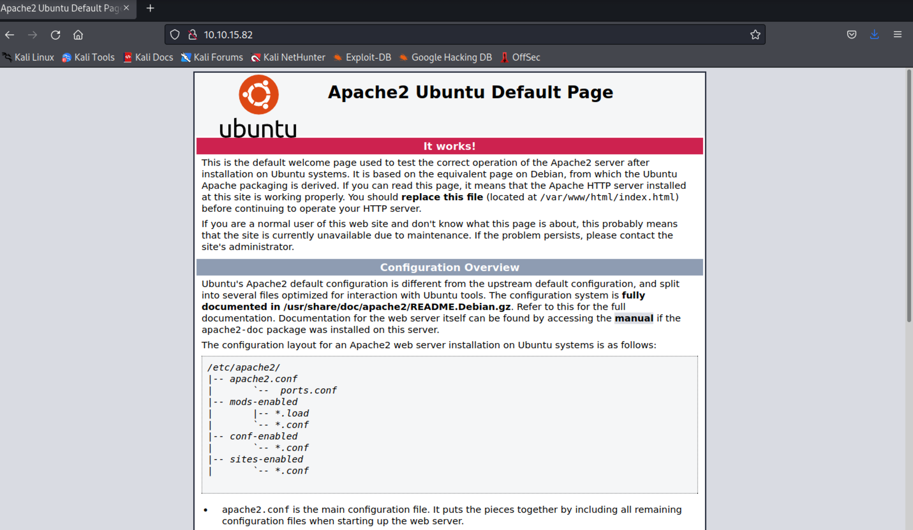
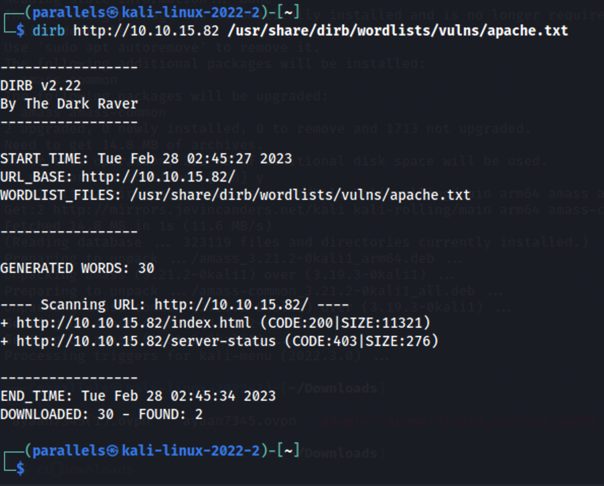
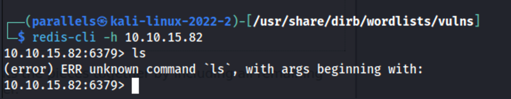

- #THM
- ReS Writeup
	- Questions
		- 1 Scan the machine, how many ports are open?
			- Used #nmap to search the open ports 
			- id:: 63fdb916-05dc-4607-804c-98e2013edfaf
			  | Ports      | Service |
			  |---------|-----|
			  | 80      | http Apache httpd 2.4.18 (Ubuntu)  | 
			  | 6379      | redis   Redis key-value store 6.0.7  |
			-
			- Answer: 2
		- 2 What's is the database management system installed on the server?
			- Used a better #nmap cammand to find what is running on the machine 
			- Answer: redis
		- 3 What port is the database management system running on?
			- This information was given from the Nmap scan ((63fdb916-05dc-4607-804c-98e2013edfaf))
			- Answer: 6379
		- 4 What's is the version of management system installed on the server?
			- This information was given from the Nmap scan ((63fdb916-05dc-4607-804c-98e2013edfaf))
			- Answer: 6.0.7
		- 5 Compromise the machine and locate user.txt
			- put the ip in a browser to see what comes up because it is a HTTP server  Not alot of information. Going to use #dirbuster to see valid domains
			- Output of dirbuster 
			  {:height 520, :width 633}
			- Did Reasech on redis found you can connect to them without password.
			  
			-
		-
-
-