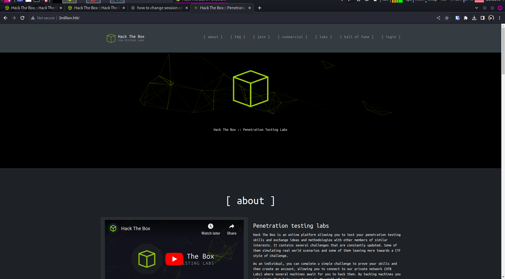
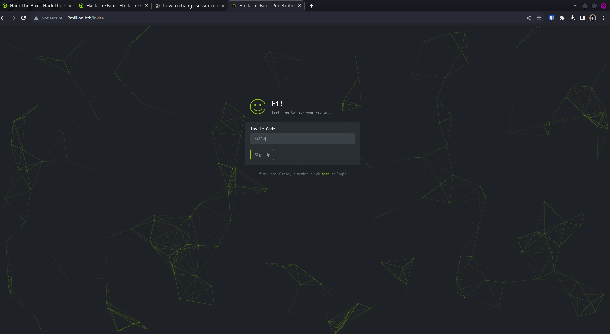
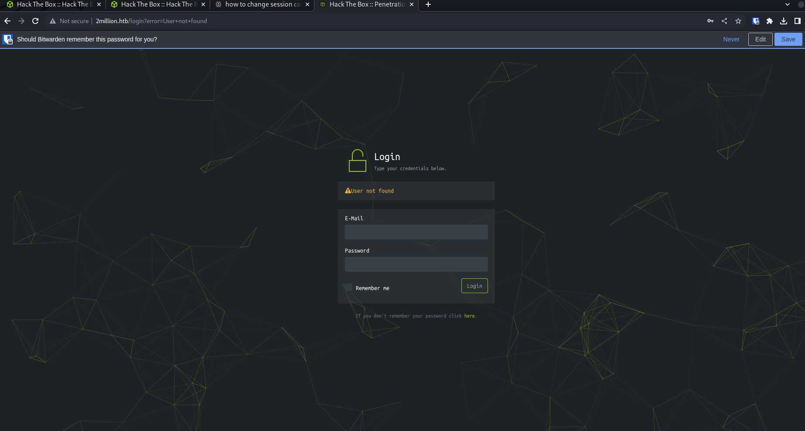
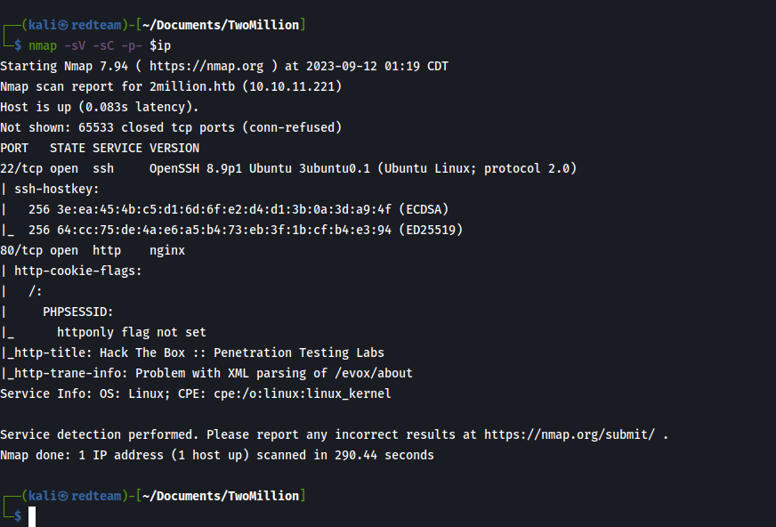

- #HTB
	- **CTF**
		- Recon
			- Nmap Scan
			- Fuff Scan
			- Nikto Scan
		- Web exploitation
		- Privilege Escalation
		- Notes
			- Resources
			- Strategies
				- Searched for the IP found a web server running 
				  
				- Found a potential attack vector 
				  
				  
				- Running a full port scan -p- with -sC for default scripts
				  
				- dirb scan
			- Other Notes
				- 
				-